# 🏥 Centro de Aplicaciones - Hospital Universitario del Valle "Evaristo García" E.S.E.

<div align="center">


[](https://github.com/hospital-huv/centro-aplicaciones)
[](LICENSE)
[](https://nodejs.org/)
[](https://developers.notion.com/)
[](https://developer.mozilla.org/en-US/docs/Web/API/WebSockets_API)
[](https://greensock.com/gsap/)

**Sistema de Gestión Centralizada de Aplicaciones Hospitalarias con Integración en Tiempo Real**

[📖 Documentación](#documentación) • [🚀 Instalación](#instalación) • [⚙️ Configuración](#configuración) • [🏗️ Arquitectura](#arquitectura) • [📊 API](#api-reference)

</div>

---

## 📋 Tabla de Contenidos

- [🎯 Descripción General](#-descripción-general)
- [✨ Características Principales](#-características-principales)
- [🏗️ Arquitectura del Sistema](#️-arquitectura-del-sistema)
- [🛠️ Stack Tecnológico](#️-stack-tecnológico)
- [📦 Instalación y Configuración](#-instalación-y-configuración)
- [🔧 Configuración Avanzada](#-configuración-avanzada)
- [📊 Estructura de Datos](#-estructura-de-datos)
- [🌐 API Reference](#-api-reference)
- [🔄 Integración con Notion](#-integración-con-notion)
- [🎨 Sistema de Diseño](#-sistema-de-diseño)
- [🧪 Testing](#-testing)
- [📈 Monitoreo y Analytics](#-monitoreo-y-analytics)
- [🔒 Seguridad](#-seguridad)
- [🚀 Deployment](#-deployment)
- [🔧 Troubleshooting](#-troubleshooting)
- [📚 Guías de Desarrollo](#-guías-de-desarrollo)
- [🤝 Contribución](#-contribución)
- [📄 Licencia](#-licencia)

---

## 🎯 Descripción General

El **Centro de Aplicaciones HUV** es una plataforma web moderna y escalable diseñada específicamente para el Hospital Universitario del Valle "Evaristo García" E.S.E. que centraliza el acceso a todas las aplicaciones hospitalarias, proporcionando una experiencia de usuario unificada y eficiente.

### 🎯 Objetivos Principales

- **Centralización**: Unificar el acceso a todas las aplicaciones hospitalarias en una sola plataforma
- **Eficiencia**: Reducir el tiempo de navegación entre sistemas mediante una interfaz intuitiva
- **Escalabilidad**: Arquitectura modular que permite agregar nuevas aplicaciones sin modificar el core
- **Tiempo Real**: Sincronización automática con Notion para actualizaciones instantáneas
- **Accesibilidad**: Cumplimiento con estándares WCAG 2.1 AA para accesibilidad universal
- **Responsive**: Diseño adaptativo para dispositivos móviles, tablets y desktop

### 🏥 Contexto Hospitalario

El sistema está diseñado para satisfacer las necesidades específicas del entorno hospitalario:

- **Departamentos Múltiples**: Soporte para administración, clínico, enfermería, farmacia, laboratorio, radiología, sistemas y recursos humanos
- **Flujos de Trabajo Críticos**: Optimización para procesos hospitalarios donde el tiempo es crucial
- **Integración Institucional**: Diseño coherente con la identidad visual del Hospital Universitario del Valle
- **Soporte Técnico Integrado**: Sistema de tickets y soporte técnico incorporado

---

## ✨ Características Principales

### 🔄 Sincronización en Tiempo Real


- **WebSocket Connection**: Conexión persistente para actualizaciones instantáneas
- **Polling Inteligente**: Sistema de respaldo con polling cada 5 segundos
- **Cache Optimizado**: Almacenamiento en memoria para respuestas rápidas
- **Reconexión Automática**: Recuperación automática de conexiones perdidas

### 🎨 Interfaz de Usuario Avanzada

- **Animaciones GSAP**: Transiciones fluidas y profesionales
- **Tema Dual**: Modo claro y oscuro con transiciones suaves
- **Filtrado Dinámico**: Filtros por categoría con conteo automático
- **Búsqueda Inteligente**: Búsqueda en tiempo real por título y descripción
- **Responsive Design**: Adaptación perfecta a todos los dispositivos

### 🎧 Sistema de Soporte Integrado

- **Formulario Inteligente**: Validación en tiempo real y campos adaptativos
- **Base de Datos Separada**: Tabla específica en Notion para reportes de soporte
- **Estados de Seguimiento**: Pendiente, En Proceso, Resuelto, Cerrado
- **Priorización**: Sistema de prioridades (Baja, Media, Alta, Crítica)
- **Notificaciones**: Confirmaciones visuales y por email

---

## 🏗️ Arquitectura del Sistema

### 📐 Diagrama de Arquitectura General


### 🔧 Componentes del Sistema

#### Frontend Architecture

| Componente | Tecnología | Responsabilidad |
|------------|------------|-----------------|
| **UI Layer** | HTML5, CSS3 | Estructura y presentación visual |
| **Logic Layer** | Vanilla JavaScript ES6+ | Lógica de negocio y manejo de estado |
| **Animation Layer** | GSAP 3.12.2 | Animaciones y transiciones |
| **Communication Layer** | WebSocket + Fetch API | Comunicación con backend |
| **State Management** | Custom State Manager | Gestión de estado de aplicación |

#### Backend Architecture

| Componente | Tecnología | Puerto | Responsabilidad |
|------------|------------|--------|-----------------|
| **HTTP Server** | Express.js | 3001 | API REST y proxy CORS |
| **WebSocket Server** | ws | 3001 | Comunicación en tiempo real |
| **Notion Client** | @notionhq/client | - | Integración con Notion API |
| **Cache Manager** | Memory Cache | - | Optimización de rendimiento |

---

## 🛠️ Stack Tecnológico

### 📋 Tecnologías Core

```yaml
Frontend:
  - HTML5: Estructura semántica y accesible
  - CSS3: Diseño responsive con CSS Grid y Flexbox
  - JavaScript ES6+: Lógica de aplicación moderna
  - GSAP 3.12.2: Animaciones de alta performance
  - WebSocket API: Comunicación en tiempo real

Backend:
  - Node.js 18.x: Runtime de JavaScript
  - Express.js 4.x: Framework web minimalista
  - WebSocket (ws): Comunicación bidireccional
  - @notionhq/client: SDK oficial de Notion

Database & Storage:
  - Notion Database: Base de datos principal
  - Memory Cache: Cache en memoria para performance
  - Local Storage: Persistencia de preferencias

DevOps & Tools:
  - npm: Gestión de dependencias
  - ESLint: Linting de código
  - Prettier: Formateo de código
  - Git: Control de versiones
```

### 📊 Dependencias del Proyecto

#### Production Dependencies

```json
{
  "@notionhq/client": "^2.2.15",
  "cors": "^2.8.5",
  "dotenv": "^16.3.1",
  "express": "^4.18.2",
  "gsap": "^3.12.2",
  "ws": "^8.14.2"
}
```

#### Development Dependencies

```json
{
  "eslint": "^8.57.0",
  "prettier": "^3.1.0",
  "nodemon": "^3.0.2",
  "jest": "^29.7.0"
}
```

---

## 📦 Instalación y Configuración

### 🔧 Requisitos del Sistema

| Requisito | Versión Mínima | Recomendada | Notas |
|-----------|----------------|-------------|-------|
| **Node.js** | 16.x | 18.x LTS | Runtime principal |
| **npm** | 8.x | 9.x | Gestor de paquetes |
| **RAM** | 512 MB | 1 GB | Para desarrollo |
| **Almacenamiento** | 100 MB | 500 MB | Incluyendo node_modules |
| **Navegador** | Chrome 90+ | Chrome Latest | Para desarrollo |

### 🚀 Instalación Rápida

```bash
# 1. Clonar el repositorio
git clone https://github.com/hospital-huv/centro-aplicaciones.git
cd centro-aplicaciones/Apps

# 2. Instalar dependencias
npm install

# 3. Configurar variables de entorno
cp .env.example .env
# Editar .env con tus credenciales

# 4. Iniciar el servidor de desarrollo
npm run dev

# 5. En otra terminal, iniciar el backend
npm run server
```

### ⚙️ Configuración de Variables de Entorno

Crear archivo `.env` en la raíz del proyecto:

```env
# Configuración de la aplicación
VITE_APP_TITLE="Centro de Aplicaciones - Hospital Universitario del Valle"
VITE_APP_DESCRIPTION="Centro de aplicaciones del Hospital Universitario del Valle Evaristo García E.S.E."

# Configuración de Notion
VITE_NOTION_TOKEN=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
VITE_NOTION_DATABASE_ID=21d8c043c53781d080b8fa8e6a660bc8
VITE_NOTION_SUPPORT_DATABASE_ID=2268c043-c537-810d-bdd3-eede4a941582

# Configuración del servidor
PORT=3001
NODE_ENV=development

# URLs de servicios
VITE_API_BASE_URL=https://api.huv.gov.co
VITE_SUPPORT_EMAIL=soporte@huv.gov.co
VITE_SUPPORT_PHONE=ext. 1234

# Configuración de WebSocket
WS_HEARTBEAT_INTERVAL=30000
WS_RECONNECT_INTERVAL=5000
WS_MAX_RECONNECT_ATTEMPTS=10

# Configuración de cache
CACHE_TTL=300000
POLLING_INTERVAL=5000
```

---

## 🔧 Configuración Avanzada

### 🏗️ Estructura del Proyecto

```
Apps/
├── 📁 src/                          # Código fuente principal
│   ├── 📄 main.js                   # Punto de entrada de la aplicación
│   ├── 📄 config.js                 # Configuración centralizada
│   ├── 📄 notion-simple.js          # Cliente de Notion optimizado
│   ├── 📄 support-service.js        # Servicio de soporte técnico
│   ├── 📄 toast.js                  # Sistema de notificaciones
│   ├── 📄 theme.js                  # Gestión de temas claro/oscuro
│   └── 📄 index.css                 # Estilos principales
├── 📁 public/                       # Archivos estáticos
│   ├── 📄 favicon.ico               # Icono de la aplicación
│   └── 📁 assets/                   # Recursos multimedia
├── 📁 docs/                         # Documentación técnica
│   ├── 📄 API.md                    # Documentación de API
│   ├── 📄 DEPLOYMENT.md             # Guía de despliegue
│   └── 📄 CONTRIBUTING.md           # Guía de contribución
├── 📁 tests/                        # Suite de pruebas
│   ├── 📁 unit/                     # Pruebas unitarias
│   ├── 📁 integration/              # Pruebas de integración
│   └── 📁 e2e/                      # Pruebas end-to-end
├── 📄 index.html                    # Página principal
├── 📄 server.js                     # Servidor backend
├── 📄 package.json                  # Configuración de npm
├── 📄 .env.example                  # Plantilla de variables de entorno
├── 📄 .gitignore                    # Archivos ignorados por Git
├── 📄 .eslintrc.js                  # Configuración de ESLint
├── 📄 .prettierrc                   # Configuración de Prettier
└── 📄 README.md                     # Este archivo
```

### ⚙️ Configuración del Sistema

#### 🎛️ Archivo de Configuración Principal (`src/config.js`)

```javascript
export const config = {
  // Configuración de la aplicación
  app: {
    name: "Centro de Aplicaciones HUV",
    version: "2.1.0",
    description: "Sistema de gestión centralizada de aplicaciones hospitalarias",
    author: "Hospital Universitario del Valle",
    repository: "https://github.com/hospital-huv/centro-aplicaciones"
  },

  // Configuración de Notion
  notion: {
    apiVersion: "2022-06-28",
    baseUrl: "https://api.notion.com/v1",
    timeout: 10000,
    retryAttempts: 3,
    retryDelay: 1000
  },

  // Configuración del servidor
  server: {
    port: process.env.PORT || 3001,
    host: process.env.HOST || "localhost",
    cors: {
      origin: ["http://localhost:3000", "http://127.0.0.1:3000"],
      credentials: true
    }
  },

  // Configuración de WebSocket
  websocket: {
    heartbeatInterval: 30000,
    reconnectInterval: 5000,
    maxReconnectAttempts: 10,
    pingTimeout: 60000
  },

  // Configuración de cache
  cache: {
    ttl: 300000, // 5 minutos
    maxSize: 1000,
    checkPeriod: 60000 // 1 minuto
  },

  // Configuración de animaciones
  animations: {
    duration: {
      fast: 0.3,
      normal: 0.5,
      slow: 0.8
    },
    easing: "power2.out",
    stagger: 0.1
  },

  // Configuración de temas
  themes: {
    default: "light",
    storageKey: "huv-theme-preference",
    transition: {
      duration: 0.3,
      easing: "power2.inOut"
    }
  }
}
```

#### 🔌 Configuración de Integración con Notion

```javascript
// Configuración específica para bases de datos de Notion
export const notionConfig = {
  databases: {
    applications: {
      id: process.env.VITE_NOTION_DATABASE_ID,
      name: "Aplicaciones HUV",
      properties: {
        name: "Name",
        description: "Description",
        category: "Category",
        url: "URL",
        icon: "Icon",
        color: "Color",
        order: "Order",
        published: "Published",
        status: "Status"
      }
    },
    support: {
      id: process.env.VITE_NOTION_SUPPORT_DATABASE_ID,
      name: "Reportes de Soporte HUV",
      properties: {
        titulo: "Titulo",
        usuario: "Usuario",
        email: "Email",
        tipo_solicitud: "Tipo_de_Solicitud",
        descripcion: "Descripcion",
        estado: "Estado",
        fecha_creacion: "Fecha_Creacion",
        prioridad: "Prioridad",
        timestamp: "Timestamp"
      }
    }
  },

  // Mapeo de categorías
  categoryMapping: {
    "Clinical": "clinico",
    "Administrative": "administrativo",
    "Laboratory": "laboratorio",
    "Radiology": "radiologia",
    "Pharmacy": "farmacia",
    "HR": "recursos",
    "Systems": "sistemas",
    "Analytics": "administrativo",
    "Project Management": "administrativo"
  },

  // Configuración de polling
  polling: {
    interval: 5000,
    maxRetries: 3,
    backoffMultiplier: 2
  }
}
```

---

## 📊 Estructura de Datos

### 🗄️ Esquema de Base de Datos - Aplicaciones

#### Tabla: `Aplicaciones HUV`

| Campo | Tipo | Requerido | Descripción | Ejemplo |
|-------|------|-----------|-------------|---------|
| **Name** | Title | ✅ | Nombre de la aplicación | "Sistema de Historia Clínica" |
| **Description** | Rich Text | ✅ | Descripción detallada | "Gestión integral de historias clínicas..." |
| **Category** | Select | ✅ | Categoría de la aplicación | "clinico" |
| **URL** | URL | ✅ | Enlace a la aplicación | "https://hc.huv.gov.co" |
| **Icon** | Rich Text | ❌ | Icono de la aplicación | "🏥" |
| **Color** | Rich Text | ❌ | Color del tema | "bg-blue-500" |
| **Order** | Number | ❌ | Orden de visualización | 1 |
| **Published** | Checkbox | ❌ | Estado de publicación | true |
| **Status** | Select | ❌ | Estado operativo | "active" |

#### Opciones de Select - Category

```yaml
Categorías Disponibles:
  - administracion: "Administración"
  - clinico: "Clínico"
  - enfermeria: "Enfermería"
  - farmacia: "Farmacia"
  - laboratorio: "Laboratorio"
  - radiologia: "Radiología"
  - sistemas: "Sistemas"
  - recursos: "Recursos Humanos"
```

#### Opciones de Select - Status

```yaml
Estados Operativos:
  - active: "Activo"
  - maintenance: "Mantenimiento"
  - deprecated: "Obsoleto"
  - development: "En Desarrollo"
```

### 🎧 Esquema de Base de Datos - Soporte

#### Tabla: `Reportes de Soporte HUV`

| Campo | Tipo | Requerido | Descripción | Ejemplo |
|-------|------|-----------|-------------|---------|
| **Titulo** | Title | ✅ | Título del reporte | "error - Juan Pérez" |
| **Usuario** | Rich Text | ✅ | Nombre del usuario | "Juan Pérez" |
| **Email** | Email | ✅ | Correo electrónico | "juan.perez@huv.gov.co" |
| **Tipo_de_Solicitud** | Select | ✅ | Tipo de solicitud | "error" |
| **Descripcion** | Rich Text | ✅ | Descripción del problema | "No puedo acceder al sistema..." |
| **Estado** | Select | ✅ | Estado del ticket | "Pendiente" |
| **Fecha_Creacion** | Date | ✅ | Fecha de creación | "2024-07-04" |
| **Prioridad** | Select | ✅ | Nivel de prioridad | "Media" |
| **Timestamp** | Rich Text | ✅ | Timestamp completo | "2024-07-04T10:30:00.000Z" |

#### Opciones de Select - Tipo_de_Solicitud

```yaml
Tipos de Solicitud:
  - sugerencia: "Sugerencia de Mejora"
  - error: "Reporte de Error"
  - consulta: "Consulta General"
  - acceso: "Problema de Acceso"
  - capacitacion: "Solicitud de Capacitación"
  - tecnico: "Soporte Técnico"
```

#### Opciones de Select - Estado

```yaml
Estados de Ticket:
  - Pendiente: "Pendiente de Revisión"
  - "En Proceso": "En Proceso de Resolución"
  - Resuelto: "Resuelto"
  - Cerrado: "Cerrado"
```

#### Opciones de Select - Prioridad

```yaml
Niveles de Prioridad:
  - Baja: "Prioridad Baja"
  - Media: "Prioridad Media"
  - Alta: "Prioridad Alta"
  - Crítica: "Prioridad Crítica"
```

### 📈 Modelo de Datos en JavaScript

#### Interfaz de Aplicación

```typescript
interface Application {
  id: string;
  title: string;
  description: string;
  category: CategoryType;
  url: string;
  icon?: string;
  color?: string;
  order?: number;
  published: boolean;
  status: StatusType;
  lastModified: Date;
}

type CategoryType =
  | 'administracion'
  | 'clinico'
  | 'enfermeria'
  | 'farmacia'
  | 'laboratorio'
  | 'radiologia'
  | 'sistemas'
  | 'recursos';

type StatusType =
  | 'active'
  | 'maintenance'
  | 'deprecated'
  | 'development';
```

#### Interfaz de Reporte de Soporte

```typescript
interface SupportTicket {
  id: string;
  titulo: string;
  usuario: string;
  email: string;
  tipoSolicitud: RequestType;
  descripcion: string;
  estado: TicketStatus;
  fechaCreacion: Date;
  prioridad: PriorityLevel;
  timestamp: string;
}

type RequestType =
  | 'sugerencia'
  | 'error'
  | 'consulta'
  | 'acceso'
  | 'capacitacion'
  | 'tecnico';

type TicketStatus =
  | 'Pendiente'
  | 'En Proceso'
  | 'Resuelto'
  | 'Cerrado';

type PriorityLevel =
  | 'Baja'
  | 'Media'
  | 'Alta'
  | 'Crítica';
```

---

## 🌐 API Reference

### 🔌 Endpoints del Backend

#### 📊 Aplicaciones

##### `GET /api/applications`

Obtiene todas las aplicaciones publicadas desde Notion.

**Parámetros de Query:**
- `category` (opcional): Filtrar por categoría
- `status` (opcional): Filtrar por estado
- `limit` (opcional): Limitar número de resultados

**Respuesta:**
```json
{
  "success": true,
  "data": [
    {
      "id": "12345678-1234-1234-1234-123456789012",
      "title": "Sistema de Historia Clínica",
      "description": "Gestión integral de historias clínicas electrónicas",
      "category": "clinico",
      "url": "https://hc.huv.gov.co",
      "icon": "🏥",
      "color": "bg-blue-500",
      "order": 1,
      "published": true,
      "status": "active",
      "lastModified": "2024-07-04T10:30:00.000Z"
    }
  ],
  "meta": {
    "total": 15,
    "categories": ["clinico", "administracion", "laboratorio"],
    "lastUpdate": "2024-07-04T10:30:00.000Z"
  }
}
```

**Códigos de Estado:**
- `200`: Éxito
- `500`: Error interno del servidor

##### `GET /api/applications/:id`

Obtiene una aplicación específica por ID.

**Parámetros:**
- `id`: ID de la aplicación en Notion

**Respuesta:**
```json
{
  "success": true,
  "data": {
    "id": "12345678-1234-1234-1234-123456789012",
    "title": "Sistema de Historia Clínica",
    "description": "Gestión integral de historias clínicas electrónicas",
    "category": "clinico",
    "url": "https://hc.huv.gov.co",
    "icon": "🏥",
    "color": "bg-blue-500",
    "order": 1,
    "published": true,
    "status": "active",
    "lastModified": "2024-07-04T10:30:00.000Z"
  }
}
```

#### 🎧 Soporte Técnico

##### `POST /api/support/submit`

Envía un nuevo reporte de soporte.

**Body:**
```json
{
  "userName": "Juan Pérez",
  "userEmail": "juan.perez@huv.gov.co",
  "requestType": "error",
  "messageDescription": "No puedo acceder al sistema de historia clínica. Aparece un error 500."
}
```

**Respuesta:**
```json
{
  "success": true,
  "message": "Solicitud enviada exitosamente",
  "id": "87654321-4321-4321-4321-210987654321",
  "timestamp": "2024-07-04T10:30:00.000Z"
}
```

**Códigos de Estado:**
- `200`: Éxito
- `400`: Datos inválidos
- `500`: Error interno del servidor

##### `GET /api/support/health`

Verifica el estado del servicio de soporte.

**Respuesta:**
```json
{
  "status": "ok",
  "message": "Servicio de soporte disponible",
  "timestamp": "2024-07-04T10:30:00.000Z"
}
```

#### 🔄 WebSocket Events

##### Eventos del Cliente al Servidor

| Evento | Descripción | Payload |
|--------|-------------|---------|
| `ping` | Heartbeat del cliente | `{ timestamp: number }` |
| `subscribe` | Suscribirse a actualizaciones | `{ type: 'applications' \| 'support' }` |
| `unsubscribe` | Desuscribirse de actualizaciones | `{ type: 'applications' \| 'support' }` |

##### Eventos del Servidor al Cliente

| Evento | Descripción | Payload |
|--------|-------------|---------|
| `pong` | Respuesta al heartbeat | `{ timestamp: number }` |
| `initial_data` | Datos iniciales al conectar | `{ type: string, data: any[], timestamp: string }` |
| `data_updated` | Notificación de actualización | `{ type: string, data: any[], timestamp: string }` |
| `connection_status` | Estado de la conexión | `{ status: 'connected' \| 'disconnected', timestamp: string }` |

### 🔧 Cliente JavaScript

#### Inicialización del Cliente

```javascript
import { NotionClient } from './src/notion-simple.js';

const client = new NotionClient();

// Configurar listeners
client.addListener((event, data) => {
  switch (event) {
    case 'data_loaded':
      console.log('Aplicaciones cargadas:', data);
      break;
    case 'data_updated':
      console.log('Datos actualizados:', data);
      break;
    case 'connection_status':
      console.log('Estado de conexión:', data);
      break;
  }
});

// Inicializar conexión
await client.initialize();
```

#### Métodos Disponibles

##### `getApplications()`

```javascript
const applications = client.getApplications();
console.log('Total de aplicaciones:', applications.length);
```

##### `getApplicationsByCategory(category)`

```javascript
const clinicApps = client.getApplicationsByCategory('clinico');
console.log('Aplicaciones clínicas:', clinicApps);
```

##### `searchApplications(query)`

```javascript
const results = client.searchApplications('historia');
console.log('Resultados de búsqueda:', results);
```

##### `submitSupportRequest(formData)`

```javascript
const result = await client.submitSupportRequest({
  userName: 'Juan Pérez',
  userEmail: 'juan.perez@huv.gov.co',
  requestType: 'error',
  messageDescription: 'Descripción del problema...'
});

if (result.success) {
  console.log('Reporte enviado exitosamente');
}
```

---

## 🔄 Integración con Notion

### 🔑 Configuración de API

#### Creación de Integración

1. **Acceder a Notion Developers**
   - Ir a [https://www.notion.so/my-integrations](https://www.notion.so/my-integrations)
   - Hacer clic en "New integration"

2. **Configurar la Integración**
   ```yaml
   Name: Centro de Aplicaciones HUV
   Associated workspace: Centro de aplicaciones
   Type: Internal
   Capabilities:
     - Read content
     - Update content
     - Insert content
   ```

3. **Obtener Token de Acceso**
   ```bash
   # Token format: ntn_xxxxxxxxxxxxxxxxxxxxxxxxxxxxxxxxxxxxxxxx
   VITE_NOTION_TOKEN=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
   ```

#### Configuración de Bases de Datos

##### Base de Datos de Aplicaciones

```yaml
Database Name: Aplicaciones HUV
Database ID: 21d8c043c53781d080b8fa8e6a660bc8
URL: https://www.notion.so/21d8c043c53781d080b8fa8e6a660bc8

Properties:
  Name:
    Type: Title
    Required: true
    Description: Nombre de la aplicación

  Description:
    Type: Rich text
    Required: true
    Description: Descripción detallada de la aplicación

  Category:
    Type: Select
    Required: true
    Options:
      - administracion
      - clinico
      - enfermeria
      - farmacia
      - laboratorio
      - radiologia
      - sistemas
      - recursos

  URL:
    Type: URL
    Required: true
    Description: Enlace directo a la aplicación

  Icon:
    Type: Rich text
    Required: false
    Description: Emoji o icono representativo

  Color:
    Type: Rich text
    Required: false
    Description: Clase CSS para el color del tema

  Order:
    Type: Number
    Required: false
    Description: Orden de visualización (menor = primero)

  Published:
    Type: Checkbox
    Required: false
    Default: false
    Description: Si la aplicación está visible públicamente

  Status:
    Type: Select
    Required: false
    Default: active
    Options:
      - active
      - maintenance
      - deprecated
      - development
```

##### Base de Datos de Soporte

```yaml
Database Name: Reportes de Soporte HUV
Database ID: 2268c043-c537-810d-bdd3-eede4a941582
URL: https://www.notion.so/2268c043c537810dbdd3eede4a941582

Properties:
  Titulo:
    Type: Title
    Required: true
    Description: Título del reporte de soporte

  Usuario:
    Type: Rich text
    Required: true
    Description: Nombre completo del usuario

  Email:
    Type: Email
    Required: true
    Description: Correo electrónico del usuario

  Tipo_de_Solicitud:
    Type: Select
    Required: true
    Options:
      - sugerencia
      - error
      - consulta
      - acceso
      - capacitacion
      - tecnico

  Descripcion:
    Type: Rich text
    Required: true
    Description: Descripción detallada del problema o solicitud

  Estado:
    Type: Select
    Required: true
    Default: Pendiente
    Options:
      - Pendiente
      - En Proceso
      - Resuelto
      - Cerrado

  Fecha_Creacion:
    Type: Date
    Required: true
    Description: Fecha de creación del reporte

  Prioridad:
    Type: Select
    Required: true
    Default: Media
    Options:
      - Baja
      - Media
      - Alta
      - Crítica

  Timestamp:
    Type: Rich text
    Required: true
    Description: Timestamp completo en formato ISO
```

### 🔄 Sincronización en Tiempo Real

#### Arquitectura de Sincronización

```mermaid
sequenceDiagram
    participant C as Cliente
    participant S as Servidor
    participant N as Notion API
    participant W as WebSocket

    C->>S: Conectar WebSocket
    S->>W: Establecer conexión
    S->>N: Consultar datos iniciales
    N->>S: Respuesta con datos
    S->>C: Enviar datos iniciales

    loop Polling cada 5 segundos
        S->>N: Verificar cambios
        N->>S: Respuesta (con/sin cambios)
        alt Hay cambios
            S->>C: Notificar actualización
            C->>C: Actualizar UI
        end
    end

    Note over S,N: Detección de cambios por timestamp
    Note over C,S: Reconexión automática si se pierde conexión
```



#### Implementación del Cliente

```javascript
class NotionRealtimeClient {
  constructor() {
    this.ws = null;
    this.reconnectAttempts = 0;
    this.maxReconnectAttempts = 10;
    this.reconnectInterval = 5000;
    this.heartbeatInterval = 30000;
    this.heartbeatTimer = null;
  }

  async connect() {
    try {
      this.ws = new WebSocket('ws://localhost:3001');

      this.ws.onopen = () => {
        console.log('✅ WebSocket conectado');
        this.reconnectAttempts = 0;
        this.startHeartbeat();
      };

      this.ws.onmessage = (event) => {
        const message = JSON.parse(event.data);
        this.handleMessage(message);
      };

      this.ws.onclose = () => {
        console.log('🔌 WebSocket desconectado');
        this.stopHeartbeat();
        this.scheduleReconnect();
      };

      this.ws.onerror = (error) => {
        console.error('❌ Error en WebSocket:', error);
      };

    } catch (error) {
      console.error('❌ Error conectando WebSocket:', error);
      this.scheduleReconnect();
    }
  }

  startHeartbeat() {
    this.heartbeatTimer = setInterval(() => {
      if (this.ws && this.ws.readyState === WebSocket.OPEN) {
        this.ws.send(JSON.stringify({
          type: 'ping',
          timestamp: Date.now()
        }));
      }
    }, this.heartbeatInterval);
  }

  stopHeartbeat() {
    if (this.heartbeatTimer) {
      clearInterval(this.heartbeatTimer);
      this.heartbeatTimer = null;
    }
  }

  scheduleReconnect() {
    if (this.reconnectAttempts < this.maxReconnectAttempts) {
      this.reconnectAttempts++;
      const delay = this.reconnectInterval * Math.pow(2, this.reconnectAttempts - 1);

      console.log(`🔄 Reintentando conexión en ${delay}ms (intento ${this.reconnectAttempts})`);

      setTimeout(() => {
        this.connect();
      }, delay);
    } else {
      console.error('❌ Máximo número de reintentos alcanzado');
    }
  }

  handleMessage(message) {
    switch (message.type) {
      case 'initial_data':
        this.handleInitialData(message.data);
        break;
      case 'data_updated':
        this.handleDataUpdate(message.data);
        break;
      case 'pong':
        // Heartbeat response
        break;
      default:
        console.log('📨 Mensaje desconocido:', message);
    }
  }
}
```

---

## 🎨 Sistema de Diseño

### 🎨 Paleta de Colores

#### Colores Institucionales

```css
:root {
  /* Colores primarios del Hospital Universitario del Valle */
  --primary-50: #eff6ff;
  --primary-100: #dbeafe;
  --primary-200: #bfdbfe;
  --primary-300: #93c5fd;
  --primary-400: #60a5fa;
  --primary-500: #3730a3;  /* Color principal institucional */
  --primary-600: #2563eb;
  --primary-700: #1d4ed8;
  --primary-800: #1e40af;
  --primary-900: #1e3a8a;

  /* Colores de estado */
  --success-50: #f0fdf4;
  --success-500: #22c55e;
  --success-600: #16a34a;

  --warning-50: #fffbeb;
  --warning-500: #f59e0b;
  --warning-600: #d97706;

  --error-50: #fef2f2;
  --error-500: #ef4444;
  --error-600: #dc2626;

  --info-50: #eff6ff;
  --info-500: #3b82f6;
  --info-600: #2563eb;
}
```

#### Tema Claro

```css
:root {
  --background: #ffffff;
  --foreground: #0f172a;
  --card: #ffffff;
  --card-foreground: #0f172a;
  --popover: #ffffff;
  --popover-foreground: #0f172a;
  --primary: #3730a3;
  --primary-foreground: #f8fafc;
  --secondary: #f1f5f9;
  --secondary-foreground: #0f172a;
  --muted: #f1f5f9;
  --muted-foreground: #64748b;
  --accent: #f1f5f9;
  --accent-foreground: #0f172a;
  --destructive: #ef4444;
  --destructive-foreground: #f8fafc;
  --border: #e2e8f0;
  --input: #e2e8f0;
  --ring: #3730a3;
  --radius: 0.5rem;
}
```

#### Tema Oscuro

```css
[data-theme="dark"] {
  --background: #020617;
  --foreground: #f8fafc;
  --card: #020617;
  --card-foreground: #f8fafc;
  --popover: #020617;
  --popover-foreground: #f8fafc;
  --primary: #6366f1;
  --primary-foreground: #0f172a;
  --secondary: #1e293b;
  --secondary-foreground: #f8fafc;
  --muted: #1e293b;
  --muted-foreground: #94a3b8;
  --accent: #1e293b;
  --accent-foreground: #f8fafc;
  --destructive: #7f1d1d;
  --destructive-foreground: #f8fafc;
  --border: #1e293b;
  --input: #1e293b;
  --ring: #6366f1;
}
```

### 🔤 Tipografía

#### Fuentes del Sistema

```css
:root {
  --font-family-primary: 'Roboto', -apple-system, BlinkMacSystemFont, 'Segoe UI', sans-serif;
  --font-family-mono: 'JetBrains Mono', 'Fira Code', 'Consolas', monospace;

  /* Escalas tipográficas */
  --text-xs: 0.75rem;     /* 12px */
  --text-sm: 0.875rem;    /* 14px */
  --text-base: 1rem;      /* 16px */
  --text-lg: 1.125rem;    /* 18px */
  --text-xl: 1.25rem;     /* 20px */
  --text-2xl: 1.5rem;     /* 24px */
  --text-3xl: 1.875rem;   /* 30px */
  --text-4xl: 2.25rem;    /* 36px */
  --text-5xl: 3rem;       /* 48px */

  /* Pesos de fuente */
  --font-weight-light: 300;
  --font-weight-normal: 400;
  --font-weight-medium: 500;
  --font-weight-semibold: 600;
  --font-weight-bold: 700;

  /* Alturas de línea */
  --line-height-tight: 1.25;
  --line-height-normal: 1.5;
  --line-height-relaxed: 1.75;
}
```

#### Clases de Utilidad Tipográfica

```css
.text-display {
  font-size: var(--text-5xl);
  font-weight: var(--font-weight-bold);
  line-height: var(--line-height-tight);
  letter-spacing: -0.025em;
}

.text-heading-1 {
  font-size: var(--text-4xl);
  font-weight: var(--font-weight-bold);
  line-height: var(--line-height-tight);
}

.text-heading-2 {
  font-size: var(--text-3xl);
  font-weight: var(--font-weight-semibold);
  line-height: var(--line-height-tight);
}

.text-heading-3 {
  font-size: var(--text-2xl);
  font-weight: var(--font-weight-semibold);
  line-height: var(--line-height-normal);
}

.text-body-large {
  font-size: var(--text-lg);
  font-weight: var(--font-weight-normal);
  line-height: var(--line-height-relaxed);
}

.text-body {
  font-size: var(--text-base);
  font-weight: var(--font-weight-normal);
  line-height: var(--line-height-normal);
}

.text-body-small {
  font-size: var(--text-sm);
  font-weight: var(--font-weight-normal);
  line-height: var(--line-height-normal);
}

.text-caption {
  font-size: var(--text-xs);
  font-weight: var(--font-weight-medium);
  line-height: var(--line-height-normal);
  text-transform: uppercase;
  letter-spacing: 0.05em;
}
```

### 🎭 Componentes de UI

#### Botones

```css
.btn {
  display: inline-flex;
  align-items: center;
  justify-content: center;
  gap: 0.5rem;
  padding: 0.5rem 1rem;
  border-radius: var(--radius);
  font-size: var(--text-sm);
  font-weight: var(--font-weight-medium);
  line-height: 1;
  text-decoration: none;
  border: 1px solid transparent;
  cursor: pointer;
  transition: all 0.2s ease-in-out;
  user-select: none;
}

.btn-primary {
  background-color: var(--primary);
  color: var(--primary-foreground);
  border-color: var(--primary);
}

.btn-primary:hover {
  background-color: var(--primary-600);
  border-color: var(--primary-600);
  transform: translateY(-1px);
  box-shadow: 0 4px 12px rgba(55, 48, 163, 0.3);
}

.btn-secondary {
  background-color: var(--secondary);
  color: var(--secondary-foreground);
  border-color: var(--border);
}

.btn-secondary:hover {
  background-color: var(--accent);
  transform: translateY(-1px);
  box-shadow: 0 2px 8px rgba(0, 0, 0, 0.1);
}

.btn-outline {
  background-color: transparent;
  color: var(--primary);
  border-color: var(--primary);
}

.btn-outline:hover {
  background-color: var(--primary);
  color: var(--primary-foreground);
}

.btn-ghost {
  background-color: transparent;
  color: var(--foreground);
  border-color: transparent;
}

.btn-ghost:hover {
  background-color: var(--accent);
  color: var(--accent-foreground);
}

/* Tamaños de botones */
.btn-sm {
  padding: 0.375rem 0.75rem;
  font-size: var(--text-xs);
}

.btn-lg {
  padding: 0.75rem 1.5rem;
  font-size: var(--text-base);
}

.btn-xl {
  padding: 1rem 2rem;
  font-size: var(--text-lg);
}

/* Estados de botones */
.btn:disabled {
  opacity: 0.5;
  cursor: not-allowed;
  transform: none !important;
  box-shadow: none !important;
}

.btn-loading {
  position: relative;
  color: transparent;
}

.btn-loading::after {
  content: '';
  position: absolute;
  top: 50%;
  left: 50%;
  width: 1rem;
  height: 1rem;
  margin: -0.5rem 0 0 -0.5rem;
  border: 2px solid currentColor;
  border-radius: 50%;
  border-top-color: transparent;
  animation: spin 1s linear infinite;
}

@keyframes spin {
  to {
    transform: rotate(360deg);
  }
}
```

#### Tarjetas

```css
.card {
  background-color: var(--card);
  color: var(--card-foreground);
  border: 1px solid var(--border);
  border-radius: var(--radius);
  box-shadow: 0 1px 3px rgba(0, 0, 0, 0.1);
  transition: all 0.2s ease-in-out;
}

.card:hover {
  box-shadow: 0 4px 12px rgba(0, 0, 0, 0.15);
  transform: translateY(-2px);
}

.card-header {
  padding: 1.5rem 1.5rem 0;
}

.card-content {
  padding: 1.5rem;
}

.card-footer {
  padding: 0 1.5rem 1.5rem;
}

.card-title {
  font-size: var(--text-lg);
  font-weight: var(--font-weight-semibold);
  line-height: var(--line-height-tight);
  margin-bottom: 0.5rem;
}

.card-description {
  font-size: var(--text-sm);
  color: var(--muted-foreground);
  line-height: var(--line-height-normal);
}

/* Variantes de tarjetas */
.card-elevated {
  box-shadow: 0 4px 6px rgba(0, 0, 0, 0.1);
}

.card-elevated:hover {
  box-shadow: 0 8px 25px rgba(0, 0, 0, 0.15);
}

.card-interactive {
  cursor: pointer;
  user-select: none;
}

.card-interactive:active {
  transform: translateY(0);
  box-shadow: 0 2px 4px rgba(0, 0, 0, 0.1);
}
```

#### Formularios

```css
.form-group {
  margin-bottom: 1.5rem;
}

.form-label {
  display: block;
  font-size: var(--text-sm);
  font-weight: var(--font-weight-medium);
  color: var(--foreground);
  margin-bottom: 0.5rem;
}

.form-label.required::after {
  content: ' *';
  color: var(--error-500);
}

.form-input {
  display: block;
  width: 100%;
  padding: 0.75rem 1rem;
  font-size: var(--text-base);
  line-height: var(--line-height-normal);
  color: var(--foreground);
  background-color: var(--background);
  border: 1px solid var(--border);
  border-radius: var(--radius);
  transition: all 0.2s ease-in-out;
}

.form-input:focus {
  outline: none;
  border-color: var(--ring);
  box-shadow: 0 0 0 3px rgba(55, 48, 163, 0.1);
}

.form-input:invalid {
  border-color: var(--error-500);
}

.form-input:invalid:focus {
  box-shadow: 0 0 0 3px rgba(239, 68, 68, 0.1);
}

.form-textarea {
  resize: vertical;
  min-height: 6rem;
}

.form-select {
  background-image: url("data:image/svg+xml,%3csvg xmlns='http://www.w3.org/2000/svg' fill='none' viewBox='0 0 20 20'%3e%3cpath stroke='%236b7280' stroke-linecap='round' stroke-linejoin='round' stroke-width='1.5' d='m6 8 4 4 4-4'/%3e%3c/svg%3e");
  background-position: right 0.5rem center;
  background-repeat: no-repeat;
  background-size: 1.5em 1.5em;
  padding-right: 2.5rem;
}

.form-error {
  display: block;
  font-size: var(--text-xs);
  color: var(--error-500);
  margin-top: 0.25rem;
}

.form-help {
  display: block;
  font-size: var(--text-xs);
  color: var(--muted-foreground);
  margin-top: 0.25rem;
}

/* Estados de formulario */
.form-group.loading .form-input {
  background-image: url("data:image/svg+xml,%3csvg xmlns='http://www.w3.org/2000/svg' fill='none' viewBox='0 0 24 24'%3e%3ccircle cx='12' cy='12' r='10' stroke='%236b7280' stroke-width='2'/%3e%3cpath fill='%236b7280' d='m12 2 0 4'/%3e%3canimateTransform attributeName='transform' dur='1s' repeatCount='indefinite' type='rotate' values='0 12 12;360 12 12'/%3e%3c/svg%3e");
  background-position: right 0.75rem center;
  background-repeat: no-repeat;
  background-size: 1rem 1rem;
  padding-right: 2.5rem;
}

.form-group.success .form-input {
  border-color: var(--success-500);
}

.form-group.error .form-input {
  border-color: var(--error-500);
}
```

### 🎬 Sistema de Animaciones

#### Configuración GSAP

```javascript
// Configuración global de GSAP
gsap.config({
  force3D: true,
  nullTargetWarn: false
});

// Configuración de animaciones por defecto
const animationDefaults = {
  duration: 0.5,
  ease: "power2.out",
  stagger: 0.1
};

// Animaciones de entrada
const entranceAnimations = {
  fadeIn: {
    from: { opacity: 0 },
    to: { opacity: 1 }
  },

  slideUp: {
    from: { opacity: 0, y: 30 },
    to: { opacity: 1, y: 0 }
  },

  slideDown: {
    from: { opacity: 0, y: -30 },
    to: { opacity: 1, y: 0 }
  },

  slideLeft: {
    from: { opacity: 0, x: 30 },
    to: { opacity: 1, x: 0 }
  },

  slideRight: {
    from: { opacity: 0, x: -30 },
    to: { opacity: 1, x: 0 }
  },

  scale: {
    from: { opacity: 0, scale: 0.8 },
    to: { opacity: 1, scale: 1 }
  },

  rotate: {
    from: { opacity: 0, rotation: -10, scale: 0.8 },
    to: { opacity: 1, rotation: 0, scale: 1 }
  }
};

// Animaciones de salida
const exitAnimations = {
  fadeOut: {
    to: { opacity: 0 }
  },

  slideUpOut: {
    to: { opacity: 0, y: -30 }
  },

  slideDownOut: {
    to: { opacity: 0, y: 30 }
  },

  scaleOut: {
    to: { opacity: 0, scale: 0.8 }
  }
};

// Funciones de utilidad para animaciones
class AnimationUtils {
  static animateIn(elements, type = 'fadeIn', options = {}) {
    const animation = entranceAnimations[type];
    if (!animation) return;

    gsap.set(elements, animation.from);
    return gsap.to(elements, {
      ...animation.to,
      ...animationDefaults,
      ...options
    });
  }

  static animateOut(elements, type = 'fadeOut', options = {}) {
    const animation = exitAnimations[type];
    if (!animation) return;

    return gsap.to(elements, {
      ...animation.to,
      ...animationDefaults,
      ...options
    });
  }

  static staggerIn(elements, type = 'slideUp', options = {}) {
    return this.animateIn(elements, type, {
      stagger: animationDefaults.stagger,
      ...options
    });
  }

  static hover(element, options = {}) {
    const tl = gsap.timeline({ paused: true });

    tl.to(element, {
      scale: 1.05,
      y: -2,
      duration: 0.2,
      ease: "power2.out",
      ...options.in
    });

    element.addEventListener('mouseenter', () => tl.play());
    element.addEventListener('mouseleave', () => tl.reverse());

    return tl;
  }

  static loading(element, options = {}) {
    return gsap.to(element, {
      rotation: 360,
      duration: 1,
      ease: "none",
      repeat: -1,
      ...options
    });
  }

  static pulse(element, options = {}) {
    return gsap.to(element, {
      scale: 1.1,
      duration: 0.5,
      ease: "power2.inOut",
      yoyo: true,
      repeat: -1,
      ...options
    });
  }
}
```

---

## 🧪 Testing

### 🔬 Estrategia de Testing

#### Pirámide de Testing


#### Configuración de Jest

```javascript
// jest.config.js
export default {
  testEnvironment: 'jsdom',
  setupFilesAfterEnv: ['<rootDir>/tests/setup.js'],
  moduleNameMapping: {
    '^@/(.*)$': '<rootDir>/src/$1',
    '^@tests/(.*)$': '<rootDir>/tests/$1'
  },
  collectCoverageFrom: [
    'src/**/*.{js,jsx}',
    '!src/**/*.d.ts',
    '!src/main.js'
  ],
  coverageThreshold: {
    global: {
      branches: 80,
      functions: 80,
      lines: 80,
      statements: 80
    }
  },
  testMatch: [
    '<rootDir>/tests/**/*.test.{js,jsx}',
    '<rootDir>/tests/**/*.spec.{js,jsx}'
  ]
};
```

#### Setup de Testing

```javascript
// tests/setup.js
import { jest } from '@jest/globals';

// Mock de WebSocket
global.WebSocket = jest.fn(() => ({
  send: jest.fn(),
  close: jest.fn(),
  addEventListener: jest.fn(),
  removeEventListener: jest.fn(),
  readyState: 1
}));

// Mock de fetch
global.fetch = jest.fn();

// Mock de GSAP
global.gsap = {
  set: jest.fn(),
  to: jest.fn(() => ({ kill: jest.fn() })),
  from: jest.fn(() => ({ kill: jest.fn() })),
  timeline: jest.fn(() => ({
    to: jest.fn(),
    from: jest.fn(),
    play: jest.fn(),
    pause: jest.fn(),
    reverse: jest.fn(),
    kill: jest.fn()
  })),
  config: jest.fn()
};

// Mock de localStorage
const localStorageMock = {
  getItem: jest.fn(),
  setItem: jest.fn(),
  removeItem: jest.fn(),
  clear: jest.fn()
};
global.localStorage = localStorageMock;

// Helpers de testing
global.waitFor = (ms) => new Promise(resolve => setTimeout(resolve, ms));

global.mockNotionResponse = (data) => {
  global.fetch.mockResolvedValueOnce({
    ok: true,
    json: async () => data
  });
};

global.mockNotionError = (error) => {
  global.fetch.mockRejectedValueOnce(error);
};
```

### 🧪 Tests Unitarios

#### Testing del Cliente de Notion

```javascript
// tests/unit/notion-client.test.js
import { NotionClient } from '@/notion-simple.js';

describe('NotionClient', () => {
  let client;

  beforeEach(() => {
    client = new NotionClient();
    jest.clearAllMocks();
  });

  describe('initialize', () => {
    it('should initialize successfully', async () => {
      mockNotionResponse({
        results: [
          {
            id: '123',
            properties: {
              Name: { title: [{ text: { content: 'Test App' } }] },
              Description: { rich_text: [{ text: { content: 'Test Description' } }] },
              Category: { select: { name: 'clinico' } },
              URL: { url: 'https://test.com' },
              Published: { checkbox: true }
            }
          }
        ]
      });

      await client.initialize();

      expect(client.applications).toHaveLength(1);
      expect(client.applications[0].title).toBe('Test App');
    });

    it('should handle initialization errors', async () => {
      mockNotionError(new Error('Network error'));

      await client.initialize();

      expect(client.applications).toHaveLength(0);
      expect(client.isConnected).toBe(false);
    });
  });

  describe('getApplicationsByCategory', () => {
    beforeEach(() => {
      client.applications = [
        { id: '1', category: 'clinico', title: 'App 1' },
        { id: '2', category: 'administracion', title: 'App 2' },
        { id: '3', category: 'clinico', title: 'App 3' }
      ];
    });

    it('should return all applications for "all" category', () => {
      const result = client.getApplicationsByCategory('all');
      expect(result).toHaveLength(3);
    });

    it('should filter applications by category', () => {
      const result = client.getApplicationsByCategory('clinico');
      expect(result).toHaveLength(2);
      expect(result.every(app => app.category === 'clinico')).toBe(true);
    });

    it('should return empty array for non-existent category', () => {
      const result = client.getApplicationsByCategory('nonexistent');
      expect(result).toHaveLength(0);
    });
  });

  describe('searchApplications', () => {
    beforeEach(() => {
      client.applications = [
        { id: '1', title: 'Historia Clínica', description: 'Sistema de historias' },
        { id: '2', title: 'Laboratorio', description: 'Gestión de laboratorio' },
        { id: '3', title: 'Farmacia', description: 'Control de medicamentos' }
      ];
    });

    it('should search by title', () => {
      const result = client.searchApplications('historia');
      expect(result).toHaveLength(1);
      expect(result[0].title).toBe('Historia Clínica');
    });

    it('should search by description', () => {
      const result = client.searchApplications('medicamentos');
      expect(result).toHaveLength(1);
      expect(result[0].title).toBe('Farmacia');
    });

    it('should be case insensitive', () => {
      const result = client.searchApplications('LABORATORIO');
      expect(result).toHaveLength(1);
      expect(result[0].title).toBe('Laboratorio');
    });

    it('should return all applications for empty query', () => {
      const result = client.searchApplications('');
      expect(result).toHaveLength(3);
    });
  });

  describe('submitSupportRequest', () => {
    const mockFormData = {
      userName: 'Test User',
      userEmail: 'test@huv.gov.co',
      requestType: 'error',
      messageDescription: 'Test description'
    };

    it('should submit support request successfully via proxy', async () => {
      global.fetch.mockResolvedValueOnce({
        ok: true,
        json: async () => ({ success: true, id: '123' })
      });

      const result = await client.submitSupportRequest(mockFormData);

      expect(result.success).toBe(true);
      expect(fetch).toHaveBeenCalledWith(
        'http://localhost:3001/api/support/submit',
        expect.objectContaining({
          method: 'POST',
          headers: { 'Content-Type': 'application/json' },
          body: JSON.stringify(mockFormData)
        })
      );
    });

    it('should fallback to direct connection if proxy fails', async () => {
      // Mock proxy failure
      global.fetch.mockRejectedValueOnce(new Error('Proxy error'));

      // Mock direct success
      global.fetch.mockResolvedValueOnce({
        ok: true,
        json: async () => ({ id: '123' })
      });

      const result = await client.submitSupportRequest(mockFormData);

      expect(result.success).toBe(true);
      expect(fetch).toHaveBeenCalledTimes(2);
    });
  });
});
```

#### Testing del Sistema de Temas

```javascript
// tests/unit/theme.test.js
import { ThemeManager } from '@/theme.js';

describe('ThemeManager', () => {
  let themeManager;

  beforeEach(() => {
    themeManager = new ThemeManager();
    document.documentElement.removeAttribute('data-theme');
    localStorage.clear();
  });

  describe('initialization', () => {
    it('should initialize with light theme by default', () => {
      themeManager.initialize();
      expect(themeManager.currentTheme).toBe('light');
    });

    it('should restore theme from localStorage', () => {
      localStorage.setItem('huv-theme-preference', 'dark');
      themeManager.initialize();
      expect(themeManager.currentTheme).toBe('dark');
    });

    it('should respect system preference', () => {
      // Mock matchMedia
      window.matchMedia = jest.fn(() => ({
        matches: true,
        addEventListener: jest.fn(),
        removeEventListener: jest.fn()
      }));

      themeManager.initialize();
      expect(themeManager.currentTheme).toBe('dark');
    });
  });

  describe('setTheme', () => {
    beforeEach(() => {
      themeManager.initialize();
    });

    it('should set theme and update DOM', () => {
      themeManager.setTheme('dark');

      expect(themeManager.currentTheme).toBe('dark');
      expect(document.documentElement.getAttribute('data-theme')).toBe('dark');
      expect(localStorage.getItem('huv-theme-preference')).toBe('dark');
    });

    it('should trigger theme change event', () => {
      const callback = jest.fn();
      themeManager.addListener(callback);

      themeManager.setTheme('dark');

      expect(callback).toHaveBeenCalledWith('dark');
    });
  });

  describe('toggleTheme', () => {
    beforeEach(() => {
      themeManager.initialize();
    });

    it('should toggle from light to dark', () => {
      themeManager.toggleTheme();
      expect(themeManager.currentTheme).toBe('dark');
    });

    it('should toggle from dark to light', () => {
      themeManager.setTheme('dark');
      themeManager.toggleTheme();
      expect(themeManager.currentTheme).toBe('light');
    });
  });
});
```

### 🔗 Tests de Integración

#### Testing de la API

```javascript
// tests/integration/api.test.js
import request from 'supertest';
import app from '@/server.js';

describe('API Integration Tests', () => {
  describe('GET /api/applications', () => {
    it('should return applications list', async () => {
      const response = await request(app)
        .get('/api/applications')
        .expect(200);

      expect(response.body).toHaveProperty('success', true);
      expect(response.body).toHaveProperty('data');
      expect(Array.isArray(response.body.data)).toBe(true);
    });

    it('should filter by category', async () => {
      const response = await request(app)
        .get('/api/applications?category=clinico')
        .expect(200);

      expect(response.body.data.every(app => app.category === 'clinico')).toBe(true);
    });
  });

  describe('POST /api/support/submit', () => {
    const validSupportData = {
      userName: 'Test User',
      userEmail: 'test@huv.gov.co',
      requestType: 'error',
      messageDescription: 'Test description'
    };

    it('should submit support request successfully', async () => {
      const response = await request(app)
        .post('/api/support/submit')
        .send(validSupportData)
        .expect(200);

      expect(response.body).toHaveProperty('success', true);
      expect(response.body).toHaveProperty('id');
      expect(response.body).toHaveProperty('timestamp');
    });

    it('should validate required fields', async () => {
      const invalidData = { userName: 'Test User' };

      const response = await request(app)
        .post('/api/support/submit')
        .send(invalidData)
        .expect(400);

      expect(response.body).toHaveProperty('success', false);
      expect(response.body).toHaveProperty('message');
    });

    it('should validate email format', async () => {
      const invalidData = {
        ...validSupportData,
        userEmail: 'invalid-email'
      };

      const response = await request(app)
        .post('/api/support/submit')
        .send(invalidData)
        .expect(400);

      expect(response.body.success).toBe(false);
    });
  });

  describe('GET /api/support/health', () => {
    it('should return health status', async () => {
      const response = await request(app)
        .get('/api/support/health')
        .expect(200);

      expect(response.body).toHaveProperty('status', 'ok');
      expect(response.body).toHaveProperty('timestamp');
    });
  });
});
```

#### Testing de WebSocket

```javascript
// tests/integration/websocket.test.js
import WebSocket from 'ws';
import { createServer } from 'http';
import app from '@/server.js';

describe('WebSocket Integration Tests', () => {
  let server;
  let wsClient;

  beforeAll((done) => {
    server = createServer(app);
    server.listen(0, () => {
      const port = server.address().port;
      wsClient = new WebSocket(`ws://localhost:${port}`);
      wsClient.on('open', done);
    });
  });

  afterAll((done) => {
    wsClient.close();
    server.close(done);
  });

  it('should establish WebSocket connection', (done) => {
    wsClient.on('open', () => {
      expect(wsClient.readyState).toBe(WebSocket.OPEN);
      done();
    });
  });

  it('should receive initial data on connection', (done) => {
    wsClient.on('message', (data) => {
      const message = JSON.parse(data);

      if (message.type === 'initial_data') {
        expect(message).toHaveProperty('data');
        expect(message).toHaveProperty('timestamp');
        expect(Array.isArray(message.data)).toBe(true);
        done();
      }
    });
  });

  it('should respond to ping with pong', (done) => {
    const pingMessage = {
      type: 'ping',
      timestamp: Date.now()
    };

    wsClient.send(JSON.stringify(pingMessage));

    wsClient.on('message', (data) => {
      const message = JSON.parse(data);

      if (message.type === 'pong') {
        expect(message).toHaveProperty('timestamp');
        done();
      }
    });
  });

  it('should broadcast updates to all clients', (done) => {
    const secondClient = new WebSocket(`ws://localhost:${server.address().port}`);

    secondClient.on('open', () => {
      // Simulate data update
      // This would normally be triggered by Notion webhook or polling

      secondClient.on('message', (data) => {
        const message = JSON.parse(data);

        if (message.type === 'data_updated') {
          expect(message).toHaveProperty('data');
          expect(message).toHaveProperty('timestamp');
          secondClient.close();
          done();
        }
      });
    });
  });
});
```

### 🎭 Tests End-to-End

#### Configuración de Playwright

```javascript
// playwright.config.js
import { defineConfig, devices } from '@playwright/test';

export default defineConfig({
  testDir: './tests/e2e',
  fullyParallel: true,
  forbidOnly: !!process.env.CI,
  retries: process.env.CI ? 2 : 0,
  workers: process.env.CI ? 1 : undefined,
  reporter: 'html',
  use: {
    baseURL: 'http://localhost:3000',
    trace: 'on-first-retry',
    screenshot: 'only-on-failure'
  },
  projects: [
    {
      name: 'chromium',
      use: { ...devices['Desktop Chrome'] }
    },
    {
      name: 'firefox',
      use: { ...devices['Desktop Firefox'] }
    },
    {
      name: 'webkit',
      use: { ...devices['Desktop Safari'] }
    },
    {
      name: 'Mobile Chrome',
      use: { ...devices['Pixel 5'] }
    },
    {
      name: 'Mobile Safari',
      use: { ...devices['iPhone 12'] }
    }
  ],
  webServer: {
    command: 'npm run dev',
    port: 3000,
    reuseExistingServer: !process.env.CI
  }
});
```

#### Tests E2E Principales

```javascript
// tests/e2e/app-navigation.spec.js
import { test, expect } from '@playwright/test';

test.describe('Application Navigation', () => {
  test.beforeEach(async ({ page }) => {
    await page.goto('/');
    await page.waitForLoadState('networkidle');
  });

  test('should load homepage successfully', async ({ page }) => {
    await expect(page).toHaveTitle(/Centro de Aplicaciones/);
    await expect(page.locator('h1')).toContainText('Centro de Aplicaciones');
  });

  test('should display applications grid', async ({ page }) => {
    await expect(page.locator('.applications-grid')).toBeVisible();
    await expect(page.locator('.application-card')).toHaveCount.greaterThan(0);
  });

  test('should filter applications by category', async ({ page }) => {
    // Click on a category filter
    await page.locator('[data-category="clinico"]').click();

    // Wait for filter animation
    await page.waitForTimeout(500);

    // Check that only clinical applications are visible
    const visibleCards = page.locator('.application-card:visible');
    await expect(visibleCards).toHaveCount.greaterThan(0);

    // Verify all visible cards have the correct category
    const cards = await visibleCards.all();
    for (const card of cards) {
      await expect(card).toHaveAttribute('data-category', 'clinico');
    }
  });

  test('should search applications', async ({ page }) => {
    const searchInput = page.locator('#search-input');
    await searchInput.fill('historia');

    // Wait for search results
    await page.waitForTimeout(300);

    const visibleCards = page.locator('.application-card:visible');
    await expect(visibleCards).toHaveCount.greaterThan(0);

    // Check that search results contain the search term
    const firstCard = visibleCards.first();
    const cardText = await firstCard.textContent();
    expect(cardText.toLowerCase()).toContain('historia');
  });

  test('should toggle theme', async ({ page }) => {
    const themeToggle = page.locator('#theme-toggle');

    // Check initial theme (should be light)
    await expect(page.locator('html')).not.toHaveAttribute('data-theme', 'dark');

    // Toggle to dark theme
    await themeToggle.click();
    await expect(page.locator('html')).toHaveAttribute('data-theme', 'dark');

    // Toggle back to light theme
    await themeToggle.click();
    await expect(page.locator('html')).not.toHaveAttribute('data-theme', 'dark');
  });

  test('should open application in new tab', async ({ page, context }) => {
    const firstAppCard = page.locator('.application-card').first();

    // Get the URL from the card
    const appUrl = await firstAppCard.getAttribute('data-url');
    expect(appUrl).toBeTruthy();

    // Click the card and expect new tab
    const [newPage] = await Promise.all([
      context.waitForEvent('page'),
      firstAppCard.click()
    ]);

    await newPage.waitForLoadState();
    expect(newPage.url()).toBe(appUrl);
  });
});
```

#### Tests E2E del Sistema de Soporte

```javascript
// tests/e2e/support-system.spec.js
import { test, expect } from '@playwright/test';

test.describe('Support System', () => {
  test.beforeEach(async ({ page }) => {
    await page.goto('/');
    await page.waitForLoadState('networkidle');
  });

  test('should navigate to support section', async ({ page }) => {
    await page.locator('nav a[href="#soporte"]').click();

    await expect(page.locator('#support-section')).toBeVisible();
    await expect(page.locator('#support-form')).toBeVisible();
  });

  test('should submit support request successfully', async ({ page }) => {
    // Navigate to support section
    await page.locator('nav a[href="#soporte"]').click();

    // Fill out the form
    await page.locator('#user-name').fill('Test User');
    await page.locator('#user-email').fill('test@huv.gov.co');
    await page.locator('#request-type').selectOption('error');
    await page.locator('#message-description').fill('This is a test support request for E2E testing.');

    // Submit the form
    const submitButton = page.locator('#support-form button[type="submit"]');
    await submitButton.click();

    // Wait for success message
    await expect(page.locator('.toast.success')).toBeVisible();
    await expect(page.locator('.toast.success')).toContainText('exitosamente');

    // Check that form is reset
    await expect(page.locator('#user-name')).toHaveValue('');
    await expect(page.locator('#user-email')).toHaveValue('');
  });

  test('should validate required fields', async ({ page }) => {
    await page.locator('nav a[href="#soporte"]').click();

    // Try to submit empty form
    await page.locator('#support-form button[type="submit"]').click();

    // Check for validation errors
    await expect(page.locator('#user-name:invalid')).toBeVisible();
    await expect(page.locator('#user-email:invalid')).toBeVisible();
  });

  test('should validate email format', async ({ page }) => {
    await page.locator('nav a[href="#soporte"]').click();

    // Fill form with invalid email
    await page.locator('#user-name').fill('Test User');
    await page.locator('#user-email').fill('invalid-email');
    await page.locator('#request-type').selectOption('error');
    await page.locator('#message-description').fill('Test message');

    await page.locator('#support-form button[type="submit"]').click();

    // Check for email validation error
    await expect(page.locator('#user-email:invalid')).toBeVisible();
  });

  test('should show loading state during submission', async ({ page }) => {
    await page.locator('nav a[href="#soporte"]').click();

    // Fill out the form
    await page.locator('#user-name').fill('Test User');
    await page.locator('#user-email').fill('test@huv.gov.co');
    await page.locator('#request-type').selectOption('error');
    await page.locator('#message-description').fill('Test message');

    // Submit and check loading state
    const submitButton = page.locator('#support-form button[type="submit"]');
    await submitButton.click();

    // Check that button is disabled and shows loading state
    await expect(submitButton).toBeDisabled();
    await expect(page.locator('.form-status.loading')).toBeVisible();
  });
});
```

---

## 📈 Monitoreo y Analytics

### 📊 Métricas del Sistema

#### Métricas de Performance

| Métrica | Objetivo | Herramienta | Frecuencia |
|---------|----------|-------------|------------|
| **Time to First Byte (TTFB)** | < 200ms | Lighthouse | Diario |
| **First Contentful Paint (FCP)** | < 1.5s | Lighthouse | Diario |
| **Largest Contentful Paint (LCP)** | < 2.5s | Lighthouse | Diario |
| **Cumulative Layout Shift (CLS)** | < 0.1 | Lighthouse | Diario |
| **First Input Delay (FID)** | < 100ms | Real User Monitoring | Continuo |
| **Memory Usage** | < 50MB | Performance API | Continuo |
| **Bundle Size** | < 500KB | Webpack Bundle Analyzer | Por build |

#### Métricas de Negocio

```javascript
// Analytics tracking
class AnalyticsTracker {
  constructor() {
    this.events = [];
    this.sessionStart = Date.now();
    this.userId = this.generateUserId();
  }

  // Eventos de aplicación
  trackApplicationClick(appId, appTitle, category) {
    this.track('application_click', {
      app_id: appId,
      app_title: appTitle,
      category: category,
      timestamp: Date.now()
    });
  }

  trackSearch(query, resultsCount) {
    this.track('search_performed', {
      query: query,
      results_count: resultsCount,
      timestamp: Date.now()
    });
  }

  trackCategoryFilter(category, applicationsCount) {
    this.track('category_filter', {
      category: category,
      applications_count: applicationsCount,
      timestamp: Date.now()
    });
  }

  trackSupportRequest(requestType, success) {
    this.track('support_request', {
      request_type: requestType,
      success: success,
      timestamp: Date.now()
    });
  }

  trackThemeChange(newTheme) {
    this.track('theme_change', {
      theme: newTheme,
      timestamp: Date.now()
    });
  }

  // Métricas de performance
  trackPageLoad() {
    if (typeof performance !== 'undefined') {
      const navigation = performance.getEntriesByType('navigation')[0];

      this.track('page_load', {
        load_time: navigation.loadEventEnd - navigation.loadEventStart,
        dom_content_loaded: navigation.domContentLoadedEventEnd - navigation.domContentLoadedEventStart,
        first_byte: navigation.responseStart - navigation.requestStart,
        timestamp: Date.now()
      });
    }
  }

  trackError(error, context) {
    this.track('error_occurred', {
      error_message: error.message,
      error_stack: error.stack,
      context: context,
      timestamp: Date.now()
    });
  }

  // Método base para tracking
  track(eventName, properties) {
    const event = {
      event: eventName,
      properties: {
        ...properties,
        user_id: this.userId,
        session_id: this.sessionId,
        url: window.location.href,
        user_agent: navigator.userAgent,
        viewport: {
          width: window.innerWidth,
          height: window.innerHeight
        }
      }
    };

    this.events.push(event);
    this.sendToAnalytics(event);
  }

  sendToAnalytics(event) {
    // Enviar a Google Analytics, Mixpanel, etc.
    if (typeof gtag !== 'undefined') {
      gtag('event', event.event, event.properties);
    }

    // Enviar a endpoint interno
    fetch('/api/analytics', {
      method: 'POST',
      headers: { 'Content-Type': 'application/json' },
      body: JSON.stringify(event)
    }).catch(console.error);
  }

  generateUserId() {
    let userId = localStorage.getItem('huv_user_id');
    if (!userId) {
      userId = 'user_' + Math.random().toString(36).substr(2, 9);
      localStorage.setItem('huv_user_id', userId);
    }
    return userId;
  }

  get sessionId() {
    return 'session_' + this.sessionStart;
  }
}
```

### 🔍 Logging y Debugging

#### Sistema de Logging

```javascript
// Logger centralizado
class Logger {
  constructor() {
    this.logLevel = process.env.NODE_ENV === 'production' ? 'warn' : 'debug';
    this.logs = [];
    this.maxLogs = 1000;
  }

  debug(message, data = {}) {
    if (this.shouldLog('debug')) {
      this.log('DEBUG', message, data);
    }
  }

  info(message, data = {}) {
    if (this.shouldLog('info')) {
      this.log('INFO', message, data);
    }
  }

  warn(message, data = {}) {
    if (this.shouldLog('warn')) {
      this.log('WARN', message, data);
    }
  }

  error(message, error = null, data = {}) {
    if (this.shouldLog('error')) {
      this.log('ERROR', message, {
        ...data,
        error: error ? {
          message: error.message,
          stack: error.stack,
          name: error.name
        } : null
      });
    }
  }

  log(level, message, data) {
    const logEntry = {
      timestamp: new Date().toISOString(),
      level: level,
      message: message,
      data: data,
      url: typeof window !== 'undefined' ? window.location.href : '',
      userAgent: typeof navigator !== 'undefined' ? navigator.userAgent : ''
    };

    // Agregar al buffer local
    this.logs.push(logEntry);
    if (this.logs.length > this.maxLogs) {
      this.logs.shift();
    }

    // Log a consola con formato
    const consoleMethod = level.toLowerCase();
    if (console[consoleMethod]) {
      console[consoleMethod](
        `[${logEntry.timestamp}] ${level}: ${message}`,
        data
      );
    }

    // Enviar logs críticos al servidor
    if (level === 'ERROR' || level === 'WARN') {
      this.sendToServer(logEntry);
    }
  }

  shouldLog(level) {
    const levels = ['debug', 'info', 'warn', 'error'];
    const currentLevelIndex = levels.indexOf(this.logLevel);
    const messageLevelIndex = levels.indexOf(level);
    return messageLevelIndex >= currentLevelIndex;
  }

  sendToServer(logEntry) {
    fetch('/api/logs', {
      method: 'POST',
      headers: { 'Content-Type': 'application/json' },
      body: JSON.stringify(logEntry)
    }).catch(() => {
      // Silently fail - no queremos crear loops de error
    });
  }

  exportLogs() {
    return this.logs;
  }

  clearLogs() {
    this.logs = [];
  }
}

// Instancia global
const logger = new Logger();
export default logger;
```

---

## 🔒 Seguridad

### 🛡️ Medidas de Seguridad Implementadas

#### Seguridad del Frontend

```javascript
// Content Security Policy
const cspConfig = {
  'default-src': ["'self'"],
  'script-src': [
    "'self'",
    "'unsafe-inline'", // Para GSAP y scripts inline necesarios
    "https://cdnjs.cloudflare.com",
    "https://unpkg.com"
  ],
  'style-src': [
    "'self'",
    "'unsafe-inline'", // Para estilos dinámicos
    "https://fonts.googleapis.com"
  ],
  'font-src': [
    "'self'",
    "https://fonts.gstatic.com"
  ],
  'img-src': [
    "'self'",
    "data:",
    "https:"
  ],
  'connect-src': [
    "'self'",
    "https://api.notion.com",
    "ws://localhost:3001",
    "wss://localhost:3001"
  ],
  'frame-ancestors': ["'none'"],
  'base-uri': ["'self'"],
  'form-action': ["'self'"]
};
```

#### Validación de Datos

```javascript
// Validador de entrada
class InputValidator {
  static validateEmail(email) {
    const emailRegex = /^[^\s@]+@[^\s@]+\.[^\s@]+$/;
    return emailRegex.test(email) && email.length <= 254;
  }

  static validateName(name) {
    // Solo letras, espacios, acentos y guiones
    const nameRegex = /^[a-zA-ZáéíóúÁÉÍÓÚñÑ\s\-']{2,50}$/;
    return nameRegex.test(name);
  }

  static validateRequestType(type) {
    const validTypes = ['sugerencia', 'error', 'consulta', 'acceso', 'capacitacion', 'tecnico'];
    return validTypes.includes(type);
  }

  static validateDescription(description) {
    return typeof description === 'string' &&
           description.length >= 20 &&
           description.length <= 2000;
  }

  static sanitizeInput(input) {
    if (typeof input !== 'string') return '';

    return input
      .trim()
      .replace(/[<>]/g, '') // Remover caracteres HTML básicos
      .replace(/javascript:/gi, '') // Remover javascript: URLs
      .replace(/on\w+=/gi, ''); // Remover event handlers
  }

  static validateSupportRequest(data) {
    const errors = [];

    if (!this.validateName(data.userName)) {
      errors.push('Nombre inválido');
    }

    if (!this.validateEmail(data.userEmail)) {
      errors.push('Email inválido');
    }

    if (!this.validateRequestType(data.requestType)) {
      errors.push('Tipo de solicitud inválido');
    }

    if (!this.validateDescription(data.messageDescription)) {
      errors.push('Descripción debe tener entre 20 y 2000 caracteres');
    }

    return {
      isValid: errors.length === 0,
      errors: errors
    };
  }
}
```

#### Seguridad del Backend

```javascript
// Middleware de seguridad para Express
import rateLimit from 'express-rate-limit';
import helmet from 'helmet';
import cors from 'cors';

// Rate limiting
const limiter = rateLimit({
  windowMs: 15 * 60 * 1000, // 15 minutos
  max: 100, // máximo 100 requests por IP
  message: {
    error: 'Demasiadas solicitudes, intenta nuevamente en 15 minutos'
  },
  standardHeaders: true,
  legacyHeaders: false
});

const supportLimiter = rateLimit({
  windowMs: 60 * 60 * 1000, // 1 hora
  max: 5, // máximo 5 reportes de soporte por hora
  message: {
    error: 'Límite de reportes de soporte alcanzado, intenta nuevamente en 1 hora'
  }
});

// Configuración de CORS
const corsOptions = {
  origin: function (origin, callback) {
    const allowedOrigins = [
      'http://localhost:3000',
      'http://127.0.0.1:3000',
      'https://aplicaciones.huv.gov.co'
    ];

    if (!origin || allowedOrigins.includes(origin)) {
      callback(null, true);
    } else {
      callback(new Error('No permitido por CORS'));
    }
  },
  credentials: true,
  optionsSuccessStatus: 200
};

// Aplicar middleware de seguridad
app.use(helmet({
  contentSecurityPolicy: {
    directives: cspConfig
  },
  hsts: {
    maxAge: 31536000,
    includeSubDomains: true,
    preload: true
  }
}));

app.use(cors(corsOptions));
app.use(limiter);
app.use('/api/support', supportLimiter);
```

#### Autenticación y Autorización

```javascript
// Sistema de autenticación básico
class AuthManager {
  constructor() {
    this.sessions = new Map();
    this.sessionTimeout = 24 * 60 * 60 * 1000; // 24 horas
  }

  generateToken() {
    return crypto.randomBytes(32).toString('hex');
  }

  createSession(userId, permissions = []) {
    const token = this.generateToken();
    const session = {
      userId: userId,
      permissions: permissions,
      createdAt: Date.now(),
      lastActivity: Date.now()
    };

    this.sessions.set(token, session);
    return token;
  }

  validateSession(token) {
    const session = this.sessions.get(token);
    if (!session) return null;

    // Verificar timeout
    if (Date.now() - session.lastActivity > this.sessionTimeout) {
      this.sessions.delete(token);
      return null;
    }

    // Actualizar última actividad
    session.lastActivity = Date.now();
    return session;
  }

  hasPermission(token, permission) {
    const session = this.validateSession(token);
    return session && session.permissions.includes(permission);
  }

  revokeSession(token) {
    this.sessions.delete(token);
  }

  cleanupExpiredSessions() {
    const now = Date.now();
    for (const [token, session] of this.sessions) {
      if (now - session.lastActivity > this.sessionTimeout) {
        this.sessions.delete(token);
      }
    }
  }
}
```

### 🔐 Gestión de Secretos

#### Variables de Entorno Seguras

```bash
# .env.production
NODE_ENV=production
PORT=3001

# Notion API (usar variables de entorno del servidor)
VITE_NOTION_TOKEN=${NOTION_API_TOKEN}
VITE_NOTION_DATABASE_ID=${NOTION_DB_ID}
VITE_NOTION_SUPPORT_DATABASE_ID=${NOTION_SUPPORT_DB_ID}

# URLs de producción
VITE_API_BASE_URL=https://api.huv.gov.co
VITE_APP_URL=https://aplicaciones.huv.gov.co

# Configuración de seguridad
SESSION_SECRET=${SESSION_SECRET}
ENCRYPTION_KEY=${ENCRYPTION_KEY}
JWT_SECRET=${JWT_SECRET}

# Configuración de email
SMTP_HOST=${SMTP_HOST}
SMTP_PORT=${SMTP_PORT}
SMTP_USER=${SMTP_USER}
SMTP_PASS=${SMTP_PASS}

# Configuración de logging
LOG_LEVEL=warn
SENTRY_DSN=${SENTRY_DSN}
```

---

## 🚀 Deployment

### 🏗️ Estrategia de Deployment

#### Arquitectura de Producción


#### Dockerfile para Producción

```dockerfile
# Dockerfile
FROM node:18-alpine AS builder

WORKDIR /app

# Copiar archivos de dependencias
COPY package*.json ./
RUN npm ci --only=production

# Copiar código fuente
COPY . .

# Build de producción
RUN npm run build

# Imagen de producción
FROM node:18-alpine AS production

WORKDIR /app

# Instalar dependencias de sistema
RUN apk add --no-cache \
    tini \
    curl

# Crear usuario no-root
RUN addgroup -g 1001 -S nodejs
RUN adduser -S nextjs -u 1001

# Copiar archivos necesarios
COPY --from=builder /app/dist ./dist
COPY --from=builder /app/node_modules ./node_modules
COPY --from=builder /app/package.json ./package.json
COPY --from=builder /app/server.js ./server.js

# Cambiar ownership
RUN chown -R nextjs:nodejs /app
USER nextjs

# Exponer puerto
EXPOSE 3001

# Health check
HEALTHCHECK --interval=30s --timeout=3s --start-period=5s --retries=3 \
  CMD curl -f http://localhost:3001/api/health || exit 1

# Usar tini como init
ENTRYPOINT ["/sbin/tini", "--"]

# Comando de inicio
CMD ["node", "server.js"]
```

#### Docker Compose para Desarrollo

```yaml
# docker-compose.yml
version: '3.8'

services:
  frontend:
    build:
      context: .
      dockerfile: Dockerfile.dev
    ports:
      - "3000:3000"
    volumes:
      - .:/app
      - /app/node_modules
    environment:
      - NODE_ENV=development
      - CHOKIDAR_USEPOLLING=true
    depends_on:
      - backend

  backend:
    build:
      context: .
      dockerfile: Dockerfile
      target: development
    ports:
      - "3001:3001"
    volumes:
      - .:/app
      - /app/node_modules
    environment:
      - NODE_ENV=development
      - PORT=3001
    env_file:
      - .env

  nginx:
    image: nginx:alpine
    ports:
      - "80:80"
      - "443:443"
    volumes:
      - ./nginx.conf:/etc/nginx/nginx.conf
      - ./ssl:/etc/nginx/ssl
    depends_on:
      - frontend
      - backend

  prometheus:
    image: prom/prometheus
    ports:
      - "9090:9090"
    volumes:
      - ./monitoring/prometheus.yml:/etc/prometheus/prometheus.yml

  grafana:
    image: grafana/grafana
    ports:
      - "3001:3000"
    environment:
      - GF_SECURITY_ADMIN_PASSWORD=admin
    volumes:
      - grafana-storage:/var/lib/grafana

volumes:
  grafana-storage:
```

#### Configuración de Nginx

```nginx
# nginx.conf
events {
    worker_connections 1024;
}

http {
    upstream frontend {
        server frontend:3000;
    }

    upstream backend {
        server backend:3001;
    }

    # Rate limiting
    limit_req_zone $binary_remote_addr zone=api:10m rate=10r/s;
    limit_req_zone $binary_remote_addr zone=support:10m rate=1r/m;

    server {
        listen 80;
        server_name aplicaciones.huv.gov.co;

        # Redirect HTTP to HTTPS
        return 301 https://$server_name$request_uri;
    }

    server {
        listen 443 ssl http2;
        server_name aplicaciones.huv.gov.co;

        # SSL Configuration
        ssl_certificate /etc/nginx/ssl/cert.pem;
        ssl_certificate_key /etc/nginx/ssl/key.pem;
        ssl_protocols TLSv1.2 TLSv1.3;
        ssl_ciphers ECDHE-RSA-AES256-GCM-SHA512:DHE-RSA-AES256-GCM-SHA512;
        ssl_prefer_server_ciphers off;

        # Security Headers
        add_header X-Frame-Options DENY;
        add_header X-Content-Type-Options nosniff;
        add_header X-XSS-Protection "1; mode=block";
        add_header Strict-Transport-Security "max-age=31536000; includeSubDomains" always;

        # Frontend
        location / {
            proxy_pass http://frontend;
            proxy_set_header Host $host;
            proxy_set_header X-Real-IP $remote_addr;
            proxy_set_header X-Forwarded-For $proxy_add_x_forwarded_for;
            proxy_set_header X-Forwarded-Proto $scheme;
        }

        # Backend API
        location /api/ {
            limit_req zone=api burst=20 nodelay;

            proxy_pass http://backend;
            proxy_set_header Host $host;
            proxy_set_header X-Real-IP $remote_addr;
            proxy_set_header X-Forwarded-For $proxy_add_x_forwarded_for;
            proxy_set_header X-Forwarded-Proto $scheme;
        }

        # Support API (más restrictivo)
        location /api/support/ {
            limit_req zone=support burst=5 nodelay;

            proxy_pass http://backend;
            proxy_set_header Host $host;
            proxy_set_header X-Real-IP $remote_addr;
            proxy_set_header X-Forwarded-For $proxy_add_x_forwarded_for;
            proxy_set_header X-Forwarded-Proto $scheme;
        }

        # WebSocket
        location /ws {
            proxy_pass http://backend;
            proxy_http_version 1.1;
            proxy_set_header Upgrade $http_upgrade;
            proxy_set_header Connection "upgrade";
            proxy_set_header Host $host;
            proxy_set_header X-Real-IP $remote_addr;
            proxy_set_header X-Forwarded-For $proxy_add_x_forwarded_for;
            proxy_set_header X-Forwarded-Proto $scheme;
        }

        # Static files caching
        location ~* \.(js|css|png|jpg|jpeg|gif|ico|svg)$ {
            expires 1y;
            add_header Cache-Control "public, immutable";
        }
    }
}
```

### 🔄 CI/CD Pipeline

#### GitHub Actions Workflow

```yaml
# .github/workflows/deploy.yml
name: Deploy to Production

on:
  push:
    branches: [main]
  pull_request:
    branches: [main]

env:
  NODE_VERSION: '18'
  REGISTRY: ghcr.io
  IMAGE_NAME: ${{ github.repository }}

jobs:
  test:
    runs-on: ubuntu-latest

    steps:
    - uses: actions/checkout@v3

    - name: Setup Node.js
      uses: actions/setup-node@v3
      with:
        node-version: ${{ env.NODE_VERSION }}
        cache: 'npm'

    - name: Install dependencies
      run: npm ci

    - name: Run linting
      run: npm run lint

    - name: Run unit tests
      run: npm run test:unit

    - name: Run integration tests
      run: npm run test:integration

    - name: Build application
      run: npm run build

    - name: Run E2E tests
      run: npm run test:e2e

  security:
    runs-on: ubuntu-latest
    needs: test

    steps:
    - uses: actions/checkout@v3

    - name: Run security audit
      run: npm audit --audit-level high

    - name: Run SAST scan
      uses: github/super-linter@v4
      env:
        DEFAULT_BRANCH: main
        GITHUB_TOKEN: ${{ secrets.GITHUB_TOKEN }}

  build:
    runs-on: ubuntu-latest
    needs: [test, security]
    if: github.ref == 'refs/heads/main'

    steps:
    - uses: actions/checkout@v3

    - name: Log in to Container Registry
      uses: docker/login-action@v2
      with:
        registry: ${{ env.REGISTRY }}
        username: ${{ github.actor }}
        password: ${{ secrets.GITHUB_TOKEN }}

    - name: Extract metadata
      id: meta
      uses: docker/metadata-action@v4
      with:
        images: ${{ env.REGISTRY }}/${{ env.IMAGE_NAME }}
        tags: |
          type=ref,event=branch
          type=sha,prefix={{branch}}-

    - name: Build and push Docker image
      uses: docker/build-push-action@v4
      with:
        context: .
        push: true
        tags: ${{ steps.meta.outputs.tags }}
        labels: ${{ steps.meta.outputs.labels }}

  deploy:
    runs-on: ubuntu-latest
    needs: build
    if: github.ref == 'refs/heads/main'
    environment: production

    steps:
    - name: Deploy to production
      uses: appleboy/ssh-action@v0.1.5
      with:
        host: ${{ secrets.PROD_HOST }}
        username: ${{ secrets.PROD_USER }}
        key: ${{ secrets.PROD_SSH_KEY }}
        script: |
          cd /opt/centro-aplicaciones
          docker-compose pull
          docker-compose up -d
          docker system prune -f
```

---

## 🔧 Troubleshooting

### 🐛 Problemas Comunes y Soluciones

#### Problemas de Conexión

| Problema | Síntomas | Solución |
|----------|----------|----------|
| **WebSocket no conecta** | No hay actualizaciones en tiempo real | 1. Verificar que el servidor esté corriendo en puerto 3001<br/>2. Revisar firewall/proxy<br/>3. Comprobar CORS settings |
| **Error de CORS** | Requests bloqueados desde el frontend | 1. Verificar configuración de CORS en server.js<br/>2. Agregar dominio a allowedOrigins<br/>3. Revisar headers de preflight |
| **Notion API timeout** | Aplicaciones no cargan | 1. Verificar token de Notion<br/>2. Comprobar límites de rate limiting<br/>3. Revisar conectividad de red |

#### Problemas de Performance

```javascript
// Herramientas de debugging de performance
class PerformanceDebugger {
  static measureFunction(fn, name) {
    return function(...args) {
      const start = performance.now();
      const result = fn.apply(this, args);
      const end = performance.now();

      console.log(`${name} took ${end - start} milliseconds`);
      return result;
    };
  }

  static measureAsyncFunction(fn, name) {
    return async function(...args) {
      const start = performance.now();
      const result = await fn.apply(this, args);
      const end = performance.now();

      console.log(`${name} took ${end - start} milliseconds`);
      return result;
    };
  }

  static logMemoryUsage() {
    if (performance.memory) {
      console.log('Memory Usage:', {
        used: Math.round(performance.memory.usedJSHeapSize / 1048576) + ' MB',
        total: Math.round(performance.memory.totalJSHeapSize / 1048576) + ' MB',
        limit: Math.round(performance.memory.jsHeapSizeLimit / 1048576) + ' MB'
      });
    }
  }

  static profileAnimations() {
    const observer = new PerformanceObserver((list) => {
      for (const entry of list.getEntries()) {
        if (entry.entryType === 'measure') {
          console.log(`Animation ${entry.name}: ${entry.duration}ms`);
        }
      }
    });

    observer.observe({ entryTypes: ['measure'] });
  }
}
```

#### Scripts de Diagnóstico

```bash
#!/bin/bash
# scripts/diagnose.sh

echo "🔍 Diagnóstico del Sistema Centro de Aplicaciones HUV"
echo "=================================================="

# Verificar Node.js
echo "📦 Versión de Node.js:"
node --version

# Verificar npm
echo "📦 Versión de npm:"
npm --version

# Verificar dependencias
echo "📦 Verificando dependencias:"
npm ls --depth=0

# Verificar puertos
echo "🔌 Verificando puertos:"
netstat -tulpn | grep -E ':(3000|3001)'

# Verificar procesos
echo "⚙️ Procesos de Node.js:"
ps aux | grep node

# Verificar logs
echo "📋 Últimos logs del sistema:"
tail -n 20 /var/log/centro-aplicaciones/app.log

# Verificar conectividad con Notion
echo "🌐 Verificando conectividad con Notion API:"
curl -s -o /dev/null -w "%{http_code}" https://api.notion.com/v1/users/me \
  -H "Authorization: Bearer $VITE_NOTION_TOKEN" \
  -H "Notion-Version: 2022-06-28"

# Verificar espacio en disco
echo "💾 Espacio en disco:"
df -h

# Verificar memoria
echo "🧠 Uso de memoria:"
free -h

echo "✅ Diagnóstico completado"
```

### 📊 Monitoreo de Salud del Sistema

```javascript
// Health check endpoint
app.get('/api/health', async (req, res) => {
  const health = {
    status: 'ok',
    timestamp: new Date().toISOString(),
    version: process.env.npm_package_version,
    uptime: process.uptime(),
    memory: process.memoryUsage(),
    checks: {}
  };

  try {
    // Verificar conexión con Notion
    const notionResponse = await fetch('https://api.notion.com/v1/users/me', {
      headers: {
        'Authorization': `Bearer ${NOTION_TOKEN}`,
        'Notion-Version': '2022-06-28'
      }
    });

    health.checks.notion = {
      status: notionResponse.ok ? 'ok' : 'error',
      responseTime: Date.now() - startTime
    };

    // Verificar base de datos de aplicaciones
    const appsResponse = await notion.databases.query({
      database_id: DATABASE_ID,
      page_size: 1
    });

    health.checks.applicationsDb = {
      status: 'ok',
      count: appsResponse.results.length
    };

    // Verificar base de datos de soporte
    const supportResponse = await notion.databases.query({
      database_id: SUPPORT_DATABASE_ID,
      page_size: 1
    });

    health.checks.supportDb = {
      status: 'ok',
      count: supportResponse.results.length
    };

  } catch (error) {
    health.status = 'error';
    health.checks.error = error.message;
  }

  const statusCode = health.status === 'ok' ? 200 : 503;
  res.status(statusCode).json(health);
});
```

---

## 📚 Guías de Desarrollo

### 🛠️ Configuración del Entorno de Desarrollo

#### Requisitos Previos

```bash
# Instalar Node.js (recomendado usar nvm)
curl -o- https://raw.githubusercontent.com/nvm-sh/nvm/v0.39.0/install.sh | bash
nvm install 18
nvm use 18

# Instalar dependencias globales
npm install -g nodemon eslint prettier

# Clonar repositorio
git clone https://github.com/hospital-huv/centro-aplicaciones.git
cd centro-aplicaciones/Apps

# Instalar dependencias
npm install

# Configurar variables de entorno
cp .env.example .env
# Editar .env con tus credenciales
```

#### Flujo de Desarrollo

```bash
# 1. Crear rama para nueva feature
git checkout -b feature/nueva-funcionalidad

# 2. Iniciar servidor de desarrollo
npm run dev

# 3. En otra terminal, iniciar backend
npm run server

# 4. Ejecutar tests durante desarrollo
npm run test:watch

# 5. Verificar linting
npm run lint

# 6. Formatear código
npm run format

# 7. Commit con mensaje descriptivo
git add .
git commit -m "feat: agregar nueva funcionalidad X"

# 8. Push y crear PR
git push origin feature/nueva-funcionalidad
```

### 📝 Estándares de Código

#### Convenciones de Naming

```javascript
// Variables y funciones: camelCase
const userName = 'Juan Pérez';
const getUserApplications = () => {};

// Constantes: UPPER_SNAKE_CASE
const API_BASE_URL = 'https://api.notion.com';
const MAX_RETRY_ATTEMPTS = 3;

// Clases: PascalCase
class NotionClient {}
class ApplicationManager {}

// Archivos: kebab-case
// notion-client.js
// support-service.js
// theme-manager.js

// CSS classes: kebab-case con prefijo
.app-card {}
.support-form {}
.theme-toggle {}

// IDs: kebab-case
#main-navigation
#support-section
#application-grid
```

#### Estructura de Commits

```bash
# Formato: tipo(scope): descripción

# Tipos válidos:
feat:     # Nueva funcionalidad
fix:      # Corrección de bug
docs:     # Cambios en documentación
style:    # Cambios de formato (no afectan lógica)
refactor: # Refactoring de código
test:     # Agregar o modificar tests
chore:    # Tareas de mantenimiento

# Ejemplos:
feat(support): agregar validación de email en formulario
fix(websocket): corregir reconexión automática
docs(readme): actualizar guía de instalación
style(css): mejorar espaciado en cards de aplicaciones
refactor(notion): simplificar cliente de API
test(unit): agregar tests para theme manager
chore(deps): actualizar dependencias de seguridad
```

### 🔄 Proceso de Code Review

#### Checklist para Pull Requests

- [ ] **Funcionalidad**
  - [ ] La funcionalidad cumple con los requisitos
  - [ ] No hay regresiones en funcionalidades existentes
  - [ ] Manejo adecuado de errores

- [ ] **Código**
  - [ ] Código limpio y legible
  - [ ] Nombres descriptivos para variables y funciones
  - [ ] Comentarios donde sea necesario
  - [ ] No hay código duplicado

- [ ] **Testing**
  - [ ] Tests unitarios para nueva funcionalidad
  - [ ] Tests de integración si aplica
  - [ ] Todos los tests pasan

- [ ] **Performance**
  - [ ] No hay memory leaks
  - [ ] Optimizaciones de rendering si aplica
  - [ ] Bundle size no aumenta significativamente

- [ ] **Seguridad**
  - [ ] Validación de inputs
  - [ ] No hay vulnerabilidades conocidas
  - [ ] Manejo seguro de datos sensibles

- [ ] **Accesibilidad**
  - [ ] Elementos semánticamente correctos
  - [ ] Soporte para lectores de pantalla
  - [ ] Navegación por teclado funcional

---

## 🤝 Contribución

### 📋 Guía para Contribuidores

#### Cómo Contribuir

1. **Fork del repositorio**
2. **Crear rama para tu feature**: `git checkout -b feature/amazing-feature`
3. **Commit tus cambios**: `git commit -m 'feat: add amazing feature'`
4. **Push a la rama**: `git push origin feature/amazing-feature`
5. **Abrir Pull Request**

#### Reportar Bugs

Usa el template de issue para reportar bugs:

```markdown
**Descripción del Bug**
Descripción clara y concisa del problema.

**Pasos para Reproducir**
1. Ir a '...'
2. Hacer clic en '....'
3. Scroll down to '....'
4. Ver error

**Comportamiento Esperado**
Descripción clara de lo que esperabas que pasara.

**Screenshots**
Si aplica, agregar screenshots para explicar el problema.

**Información del Sistema:**
 - OS: [e.g. Windows 10]
 - Navegador [e.g. Chrome, Safari]
 - Versión [e.g. 22]

**Contexto Adicional**
Cualquier otra información relevante sobre el problema.
```

### 👥 Equipo de Desarrollo

| Rol | Responsabilidad | Contacto |
|-----|----------------|----------|
| **Tech Lead** | Arquitectura y decisiones técnicas | tech-lead@huv.gov.co |
| **Frontend Developer** | Desarrollo de interfaz de usuario | frontend@huv.gov.co |
| **Backend Developer** | Desarrollo de API y servicios | backend@huv.gov.co |
| **DevOps Engineer** | Infraestructura y deployment | devops@huv.gov.co |
| **QA Engineer** | Testing y calidad | qa@huv.gov.co |

---

## 📄 Licencia

Este proyecto está licenciado bajo la Licencia MIT - ver el archivo [LICENSE](LICENSE) para detalles.

```
MIT License

Copyright (c) 2024 Hospital Universitario del Valle "Evaristo García" E.S.E.

Permission is hereby granted, free of charge, to any person obtaining a copy
of this software and associated documentation files (the "Software"), to deal
in the Software without restriction, including without limitation the rights
to use, copy, modify, merge, publish, distribute, sublicense, and/or sell
copies of the Software, and to permit persons to whom the Software is
furnished to do so, subject to the following conditions:

The above copyright notice and this permission notice shall be included in all
copies or substantial portions of the Software.

THE SOFTWARE IS PROVIDED "AS IS", WITHOUT WARRANTY OF ANY KIND, EXPRESS OR
IMPLIED, INCLUDING BUT NOT LIMITED TO THE WARRANTIES OF MERCHANTABILITY,
FITNESS FOR A PARTICULAR PURPOSE AND NONINFRINGEMENT. IN NO EVENT SHALL THE
AUTHORS OR COPYRIGHT HOLDERS BE LIABLE FOR ANY CLAIM, DAMAGES OR OTHER
LIABILITY, WHETHER IN AN ACTION OF CONTRACT, TORT OR OTHERWISE, ARISING FROM,
OUT OF OR IN CONNECTION WITH THE SOFTWARE OR THE USE OR OTHER DEALINGS IN THE
SOFTWARE.
```

---

## 📞 Soporte y Contacto

### 🎧 Soporte Técnico

- **Email**: soporte@huv.gov.co
- **Teléfono**: +57 (2) 555-1234 ext. 1234
- **Horario**: Lunes a Viernes, 8:00 AM - 6:00 PM

### 🏥 Hospital Universitario del Valle

- **Dirección**: Calle 5 # 36-08, Cali, Valle del Cauca, Colombia
- **Teléfono Principal**: +57 (2) 555-1234
- **Website**: [https://www.huv.gov.co](https://www.huv.gov.co)

### 📊 Métricas del Proyecto


---

<div align="center">

**Desarrollado con ❤️ por el equipo de Sistemas del Hospital Universitario del Valle**

[🏠 Inicio](#-centro-de-aplicaciones---hospital-universitario-del-valle-evaristo-garcía-ese) • [📖 Documentación](#documentación) • [🚀 Instalación](#instalación) • [🤝 Contribuir](#contribución)

</div>
```
```
```
```
